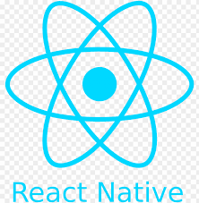

<h1 align="center">
  
</h1>

 
 

I am a versatilist and easily adapt to different hats (Full Stack Web Developer 🌐, MERN Stack Developer 📱, Competitive Programmer 💻 and Web Designer 🎨). I love exploring new tech stacks 💻 and leveraging them to build cool stuff 🛠️. 
 
 

 
  
### 🧐 More About Me:

- 🔭 &nbsp; I’m currently working on **Chat-Engine**
- 🌱 &nbsp; I’m currently learning React JS; 
- 👨🏻‍💻 &nbsp; Most of my projects are available on [Github](https://github.com/Paramhans-Singh);
- 💬 &nbsp; For any collaboration or query mail me at [Email](paramhanssingh084@gmail.com);
- 📫 &nbsp; Feel free to ping me on [LinkedIn](https://www.linkedin.com/in/paramhans-singh13/);
- 📝 &nbsp; Checkout my [Resume](https://drive.google.com/file/d/15cVu-vBQDo0m4yT3Z0a5k1iaY3ri0h0L/view?usp=sharing);
 

### 🔨 Languages and Tools:

 
 

 
 

###  💻  GitHub Stats:

 | 
| ------------- | ------------- |

### 🌐 Top Repositories

